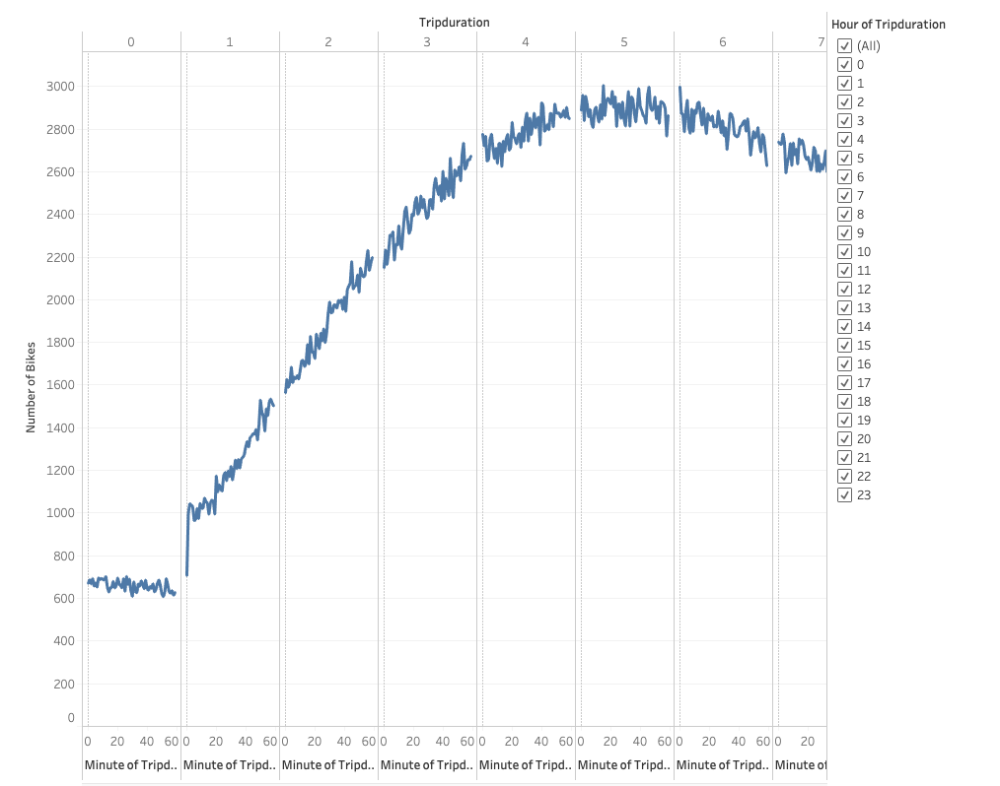
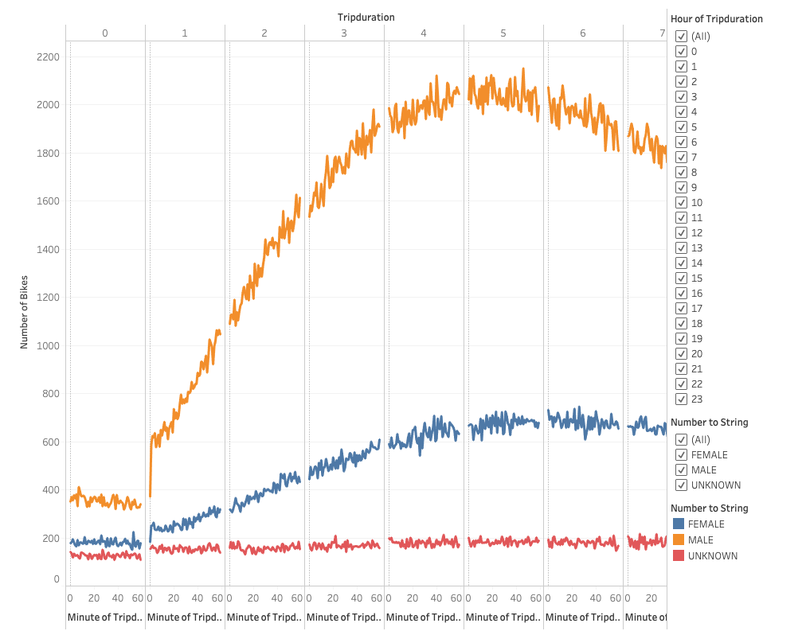
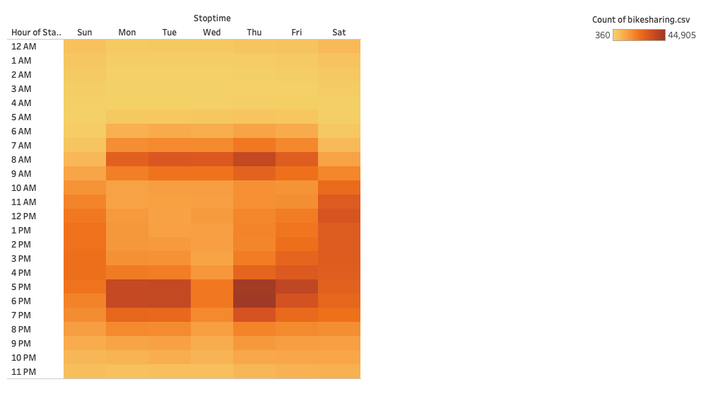
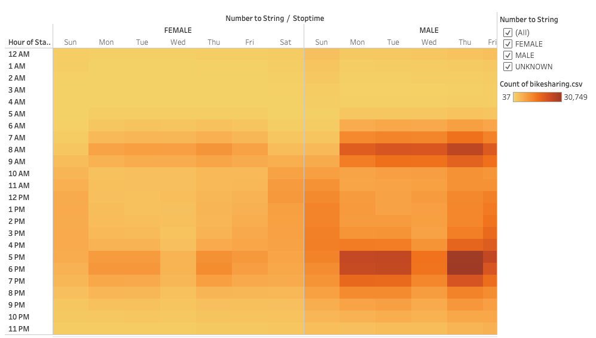
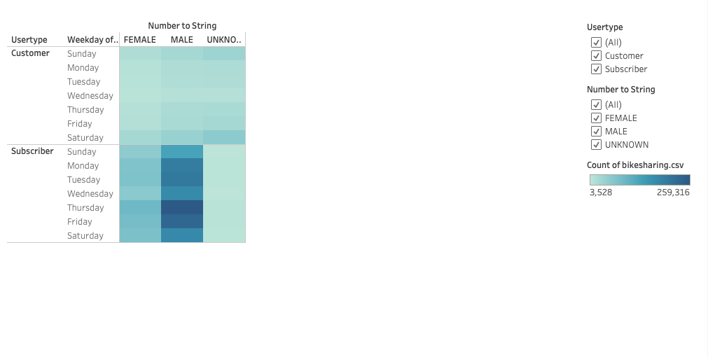
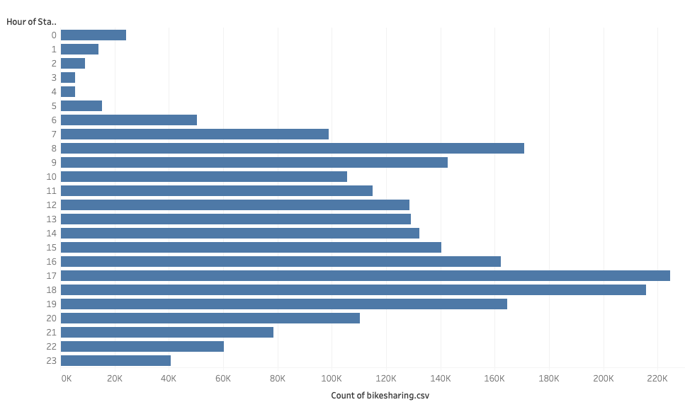
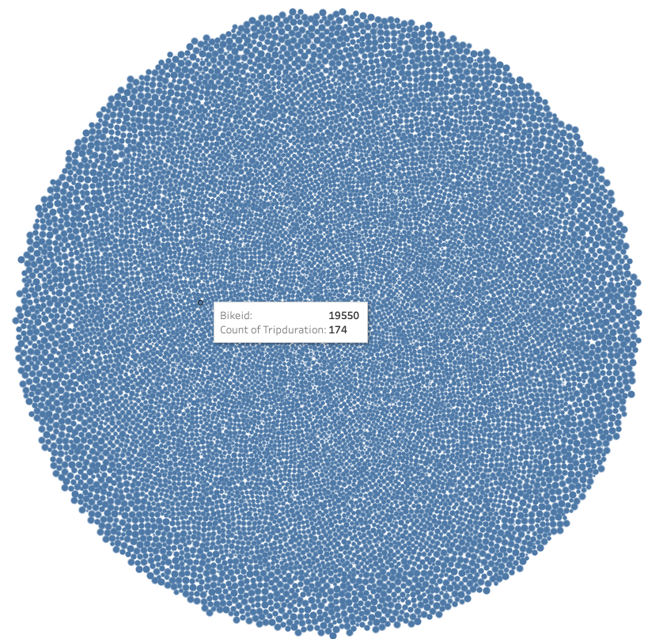

# bikesharing

# Overview
My business partner and I recently visited New York, where we observed a successful bikesharing business.  We thought this would be a great venture to bring back to our hometown of Des Moines, so we began to research what made a bikesharing business successful.  The purpose of this analysis is to determine how often bikes are rented, when the most popular times to rent bike are, how frequently bikes need to be serviced, and other important details that will help sell our idea to investors.  Our goal is to illustrate that a bikesharing company would be successful in Des Moines. 

# Results

## Checkout Times

This visualization shows us that the largest number of bikes are checked out for a trip that lasts approximately 4-6 hours.  The visualization also shows us that very few bikes are checked out for trips that last less than 2 hours.  

## Checkout Times by Gender

This visualization shows us that on average more men checkout bikes than women.  It also illustrates that despite the difference in numbers, men and women typically checkout bikes for a similar trip duration.  There is some evidence that women checkout bikes for longer trips, lasting into the 7-8 hour duration.  This contrasts with the men's trip durations, which appear to drop of sharply after the 6 hour mark.  

## Trips by Weekday

This visualization shows us that the most popular time to checkout a bike is Thursday evenings beween 5 and 6 pm.  The visualization also illustrates that weekends have a fairly consistent rate of bikes being checked out throughout the day.  An interesting point to note is that Wednesday evenings do not appear to have many bikes checked out, which contrasts with the other weekday evenings. 

## Trips by Gender

This visualization supports the analysis that men check out more bikes on average than women.  The visualization also confirms that Thursday's between 5-6pm is the most popular time to rent across both genders, while Wednesday evening is the least popular time.

## Trips by Gender by Weekday

This visualization shows us that subscribers rent far more bikes than per-use customers.  The visualization also supports the claim that men check out more bikes on average than women. 

## August Peak Hours

This visualization shows that 5PM, 6PM, and 8AM are the three busiest times for bike rentals.  It also illustrates that less than 25,000 bike rentals occurred during the hours of 12AM and 6AM.

## Bike Utilization

This visualization illustrates that bikes in the citibike fleet all received a farily even amount of use.  The visualizaton shows that the most used bikes were used between 400-500 times each, and no bike was used significantly more than the rest. 

# Summary
One of the main takeaways from this analysis is that subscribers rent significantly more bikes than per-use customers.  The goal for our business will be to encourage subscriptions over per-use purchases in our pricing model.  Another important insight is that men rent more bikes than women.  This would come into play in our advertising strategy and who we target with our marketing.  Another notable point is that the bikes are used consistently, with no bike being used significantly more than any other.  Our Bike Utilization vizualization illustrates that there are no overused bikes that would require unusual maintenance.  One additional vizualization that we could run would be a bar chart illustrating the frequency with which per-use customers return and rent bikes again.  This would help determine the difference in value between subscribers and per-use customers.  Another vizualization which would be helpful in determining the success of our business would be an analysis of how far each bike travels during the trip duration.  This would help us to understand how much use each bike is getting during the rental period. 
